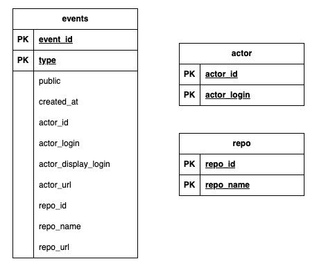
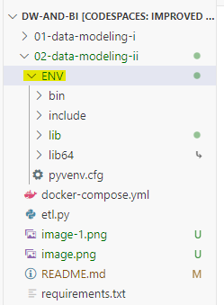
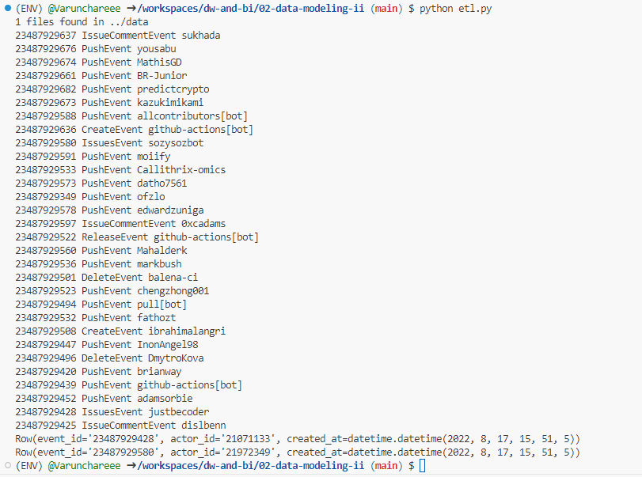

## Data Modeling with Cassandra

## Documentation
### 1. เปลี่ยน Directory ให้อยู่ใน Folder 02-data-modeling-ii

$ cd 02-data-modelling-II

### 2. สร้าง Environment Python เพื่อรองรับการการติดตั้ง Library ให้เหมาะสมกับงาน
$ python -m venv ENV

### 3. Active Environment ที่สร้างไว้ให้สามารถใช้งานได้
$ source ENV/bin/activate

### 4. Install Library ที่เกี่ยวข้องกับการใช้งาน

$ pip install -r requirements.txt

### 5. เริ่มการใช้งาน Cassandra ด้วย Docker

$ docker compose up

### 6. หากต้องการสร้าง table, เพิ่มข้อมูล, Query ข้อมูล สามารถทำได้ใน etl.py

$ python ety.py

### 7. Run python etl.py

