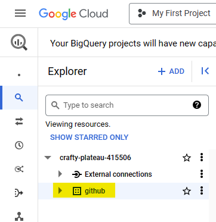
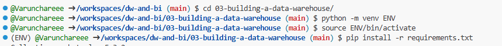
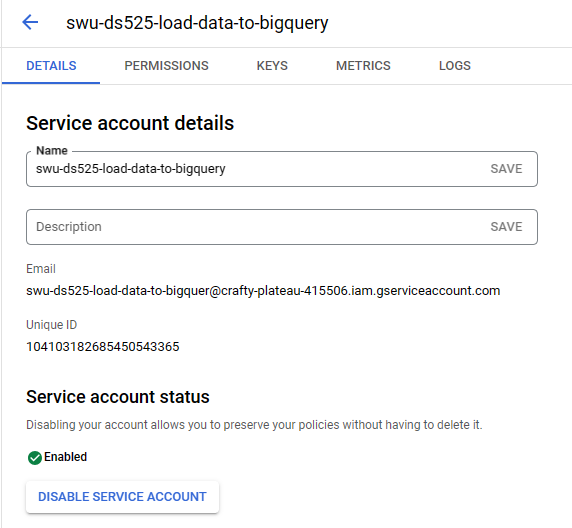
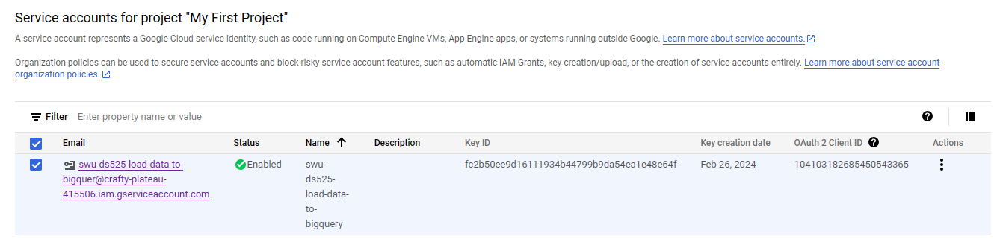
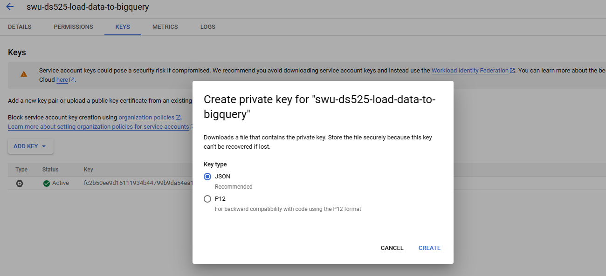
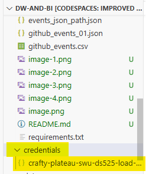
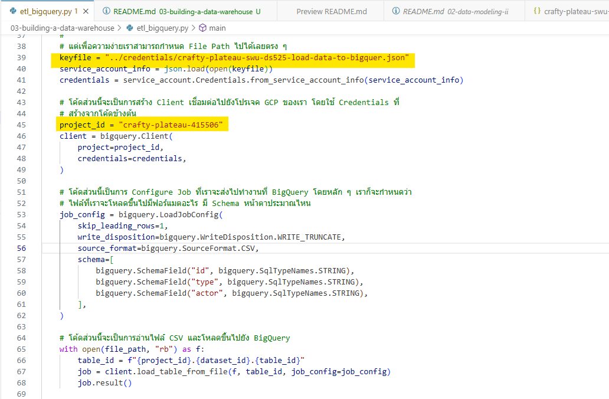
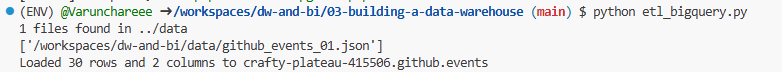
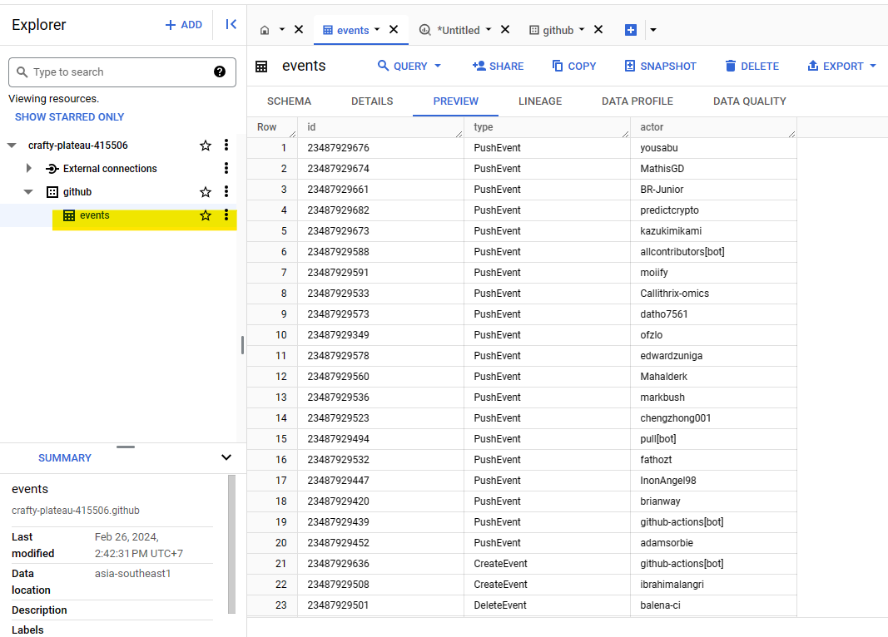
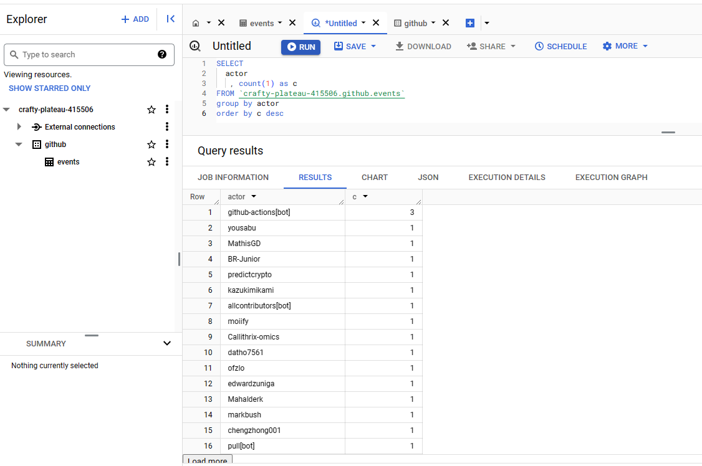

## Building a Data Warehouse
1. สร้าง Data set ชื่อ github บน bigquery

pip install -r requirements.txt

2. สร้าง service account บน bigquery และกำหนดสิทธิ์
   โดยเลือกกำหนดสิทธิ์เป็น BigQuery Admin

3. เข้าไป service account แล้วทำการ download key เลือก Key type เป็น JSON

4. นำไฟล์ Key ที่ download มาไว้ที่ Folder credentials

5. ไปที่ etl_bigquery.py แล้วนำชื่อไฟล์ Key ไปใส่ใน Key parth และใส่ชื่อ project_id ให้ตรงกับบน bigquery

6. Run python etl_bigquery.py

7. ไปที่ bigquery จะพบ table events ที่สร้างขึ้นมา

8. ทดลอง query data บน bigquery

