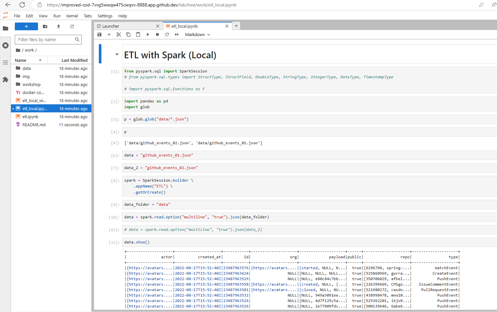

# Building a Data Lake

เพื่อให้เราสามารถสร้างไฟล์ได้จาก Jupyter Lab ให้รันคำสั่งด้านล่างนี้

```sh
sudo chmod 777 .
```

แล้วค่อยรัน

```sh
docker-compose up
```

จากนั้นเปิด Ports 8888 ขึ้นมา แล้วใส่ Token ในการ Login เข้า Jupyter notebook

Run code ETL_Local.ipynb


